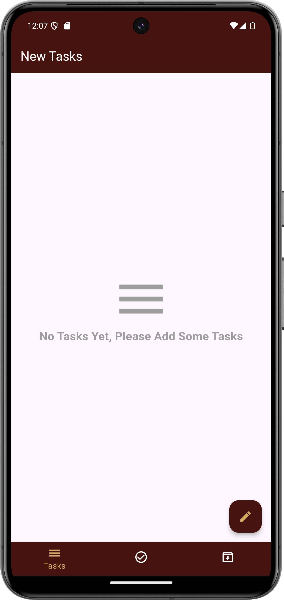
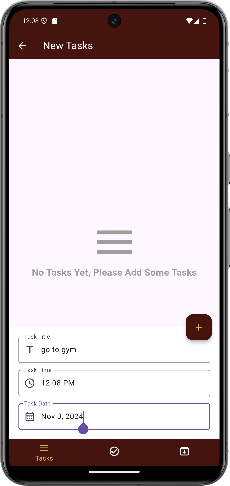
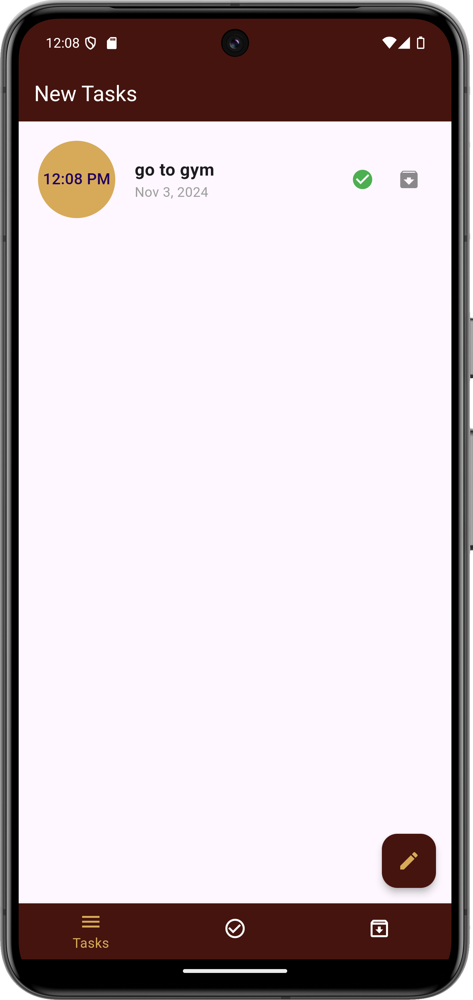

# Taskly

Taskly is a simple and intuitive task management mobile application built with Flutter. It allows users to add, edit, and view tasks with specific time and date settings.

## Features

- Add new tasks with titles, time, and date.
- View tasks in a clean and organized layout.
- Mark tasks as completed or pending.
- **Archive Tasks**: Archive tasks that are no longer active but should be saved for later reference.
- **Swipe to Delete**: Swipe tasks to delete them quickly and easily.

## Screenshots

| No Tasks Screen | Add Task Screen | Task List Screen |
|-----------------|-----------------|------------------|
|  |  |  |

## Getting Started

These instructions will get you a copy of the project up and running on your local machine for development and testing purposes.

### Prerequisites

- Flutter SDK: [Flutter installation guide](https://flutter.dev/docs/get-started/install)
- Android Studio or Visual Studio Code with Flutter and Dart plugins
- A physical or virtual device to run the app

### Installing

1. Clone the repository:

   ```bash
   git clone https://github.com/BeshoAsham/Taskly.git
   cd taskly
   ```

2. Install dependencies:

   ```bash
   flutter pub get
   ```

3. Run the app:

   ```bash
   flutter run
   ```

## Project Structure

Here's a brief overview of the project structure:

- **`lib/`**: Contains all the Dart code for the app, organized by feature.
- **`assets/`**: Stores images and other assets used within the app.
- **`pubspec.yaml`**: The project configuration file, listing dependencies and assets.

## Built With

- [Flutter](https://flutter.dev/) - The framework used to build cross-platform applications.
- [BLoC](https://bloclibrary.dev/) - For state management.
- [sqflite](https://pub.dev/packages/sqflite) - For local database storage.

## Contributing

We welcome contributions to Taskly! If you have suggestions or improvements, feel free to:

1. **Fork the repository**.
2. **Create a branch** for your feature or fix.
3. **Commit your changes**.
4. **Push to your branch**.
5. **Create a pull request**.

For major changes, please open an issue first to discuss what you would like to change.

### Example:

```bash
# Fork and clone the repository
git clone https://github.com/BeshoAsham/Taskly.git
cd taskly

# Create a new branch for your changes
git checkout -b feature-name

# Make changes, commit, and push
git commit -m "Description of changes"
git push origin feature-name
```
## Contact

- **Developer:** Beshoy Ibrahim Asham
- **Email:** beshoyibrahimashammelek@gmail.com

Feel free to reach out if you have any questions or feedback!

---


